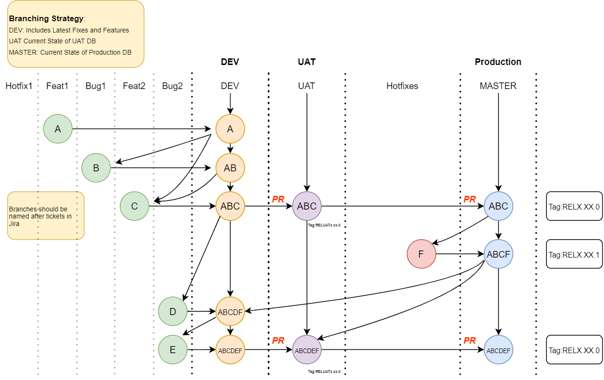

# React-Deployment

This repository contains a React app that demonstrates how to deploy a React app to a live environment and access environment variables.

Link: https://singular-torrone-83c4bb.netlify.app/

## Purpose of Production Environemnt

The purpose of a production environment is to provide a stable and secure space where live software applications or services can be deployed and accessed by end-users. This environment is the final destination for software applications and features after they have been thoroughly tested and refined in the development and testing phases

## Environment Variables

Environment variables are a way to store configuration information outside of your code. They're commonly used to store sensitive information, such as API keys or database credentials, that you don't want to expose in your codebase. In a Vite React app, you can define environment variables in a `.env` file at the root of your project.

## How to Define and Access Env in Vite React App

To define an environment variable in a Vite React app, create a `.env` file at the root of your project and prefix the variable name with `VITE_` For example, if you wanted to define an API key, you could create a variable called `VITE_API_KEY` in your `.env` file.

To access the environment variable in your app, use the `import.meta.env object`. For example, to access the `VITE_API_KEY` variable, you could use `import.meta.env.VITE_API_KEY` in your code.

## How to Use This App

To use this app, follow these steps:

- Clone this repository to your local machine.
- Install dependencies by running
  ```bash
  npm install
  ```
- Create a `.env` file at the root of your project and define your environment variables like
  ```bash
  VITE_APP_MODE='THIS IS PRODUCTION MODE'
  ```
- Build the app for production by running
  ```bash
  npm run build
  ```
- Serve the app in production mode by running
  ```bash
  npm run serve
  ```

## How Structure of Git Branches works in Real Projects

A Git branching strategy that includes "Master," "UAT," "Dev," and "Feature" branches is a common approach to managing software development projects. Here's how this strategy works:

- **Master Branch**: The "master" branch is where you store the production-ready code. This is the branch that you'll deploy to your live environment.

- **UAT Branch**: The "UAT" (user acceptance testing) branch is where you test changes in a staging environment before promoting them to the production environment. This branch helps ensure that new changes and features work as expected and don't introduce regressions or other issues.

- **Dev Branch**: The "dev" branch is where you integrate new features and bug fixes before they're merged into the UAT or master branch. This branch is often used by developers to work on new features or bug fixes independently of other team members.

- **Feature Branch**: The "feature" branch is where developers work on new features or bug fixes. Each new feature or bug fix should have its own branch. This helps ensure that changes can be worked on independently and merged back into the dev branch when they're ready.



# How to Deploy React App

I use Netlify to deploy my react-project there are 2 ways to deploy your react app. I cover both ways in below

## 1) Using Github Repository

- Go to Netlify and Click on `Add New Site` Button and Click on `import existing project`
- Select `Github` option and pick your repository
- Select `branch` that you want to deploy (Genrally `main` for production)
- give build command `npm run build` and add `dist` to public directory
- click on `Advance option` and add `enviornment variable` that is in your `.env` file
- click on Deploy Button.

## 2) Using upload Build/Dist folder

- Go to your project root directory and and run command `npm run build`
- you can see the `build/dist` folder is created.
- Now Go to Netlify and Click on `Add New Site` Button and Click on `Deploy Manually`
- you can see drag & drop page. drop your `build/dist` folder into it.
- you can add `enviornment variable` in deploy setting.
